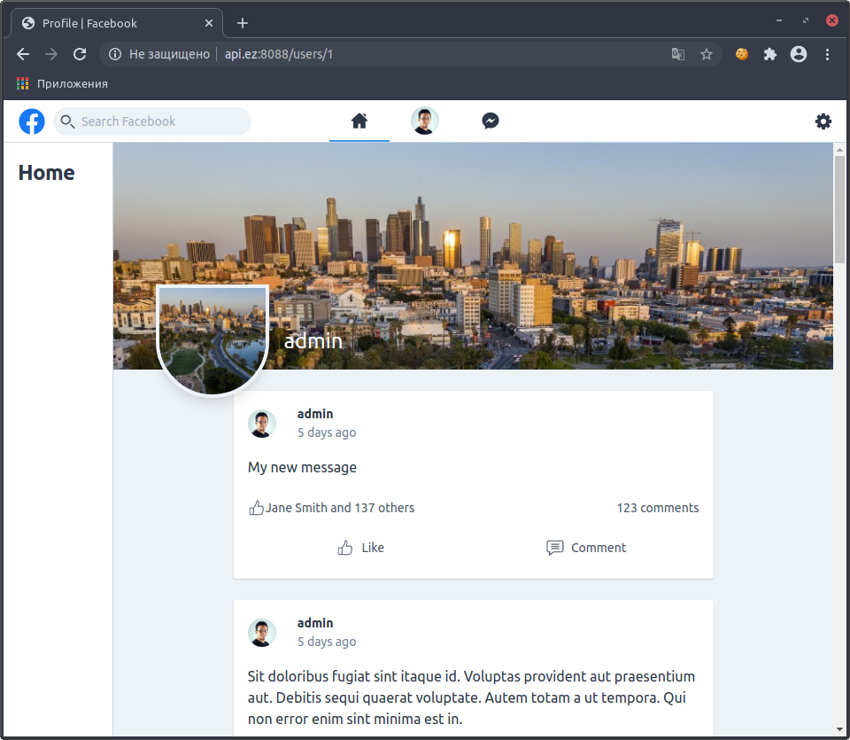

## MyFacebook on Laravel


The project was created on the basis of the course "Facebook Clone with Laravel, TDD, Vue & Tailwind CSS" Course author: Victor Gonzalez on Udemy.com.




## Getting Started 
   The requirements to application is:
   *    **PHP - Supported Versions**: >= 7.1
   *    **Webserver**: Nginx or Apache
   *    **Database**: MySQL, or Maria DB
   ### Git Clone
   ```sh
   $ git clone https://github.com/evgeniizab/laravel.myfacebook.git
   $ cd laravel.myfacebook
...
   ```
