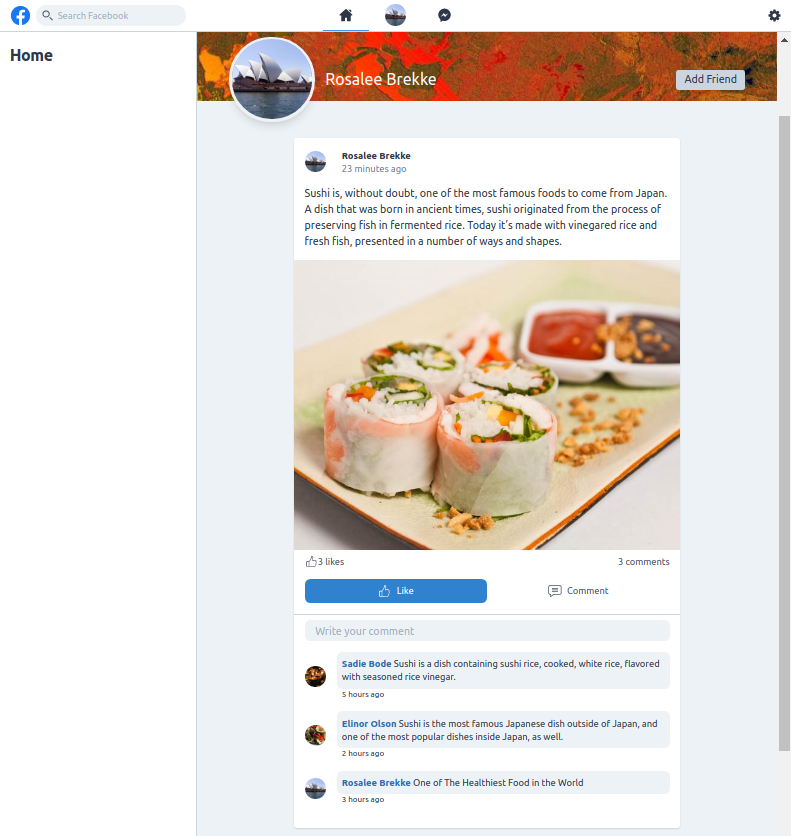

## MyFacebook on Laravel


The project was created on the basis of the course "Facebook Clone with Laravel, TDD, Vue & Tailwind CSS" Course author: Victor Gonzalez on Udemy.com.


### Requirements
The requirements to application is:
*    **PHP - Supported Versions**: >= 7
*    **Webserver**: Nginx or Apache
*    **Database**: MySQL, or Maria DB
### Installation
#### 1. Git Clone

```sh
$ git clone https://github.com/evgeniizab/laravel.myfacebook.git
$ cd laravel.myfacebook
$ composer install
$ npm install
```

#### 2. Database
Copy .env.example to .env
```sh
$ cp .env.example .env
```
Edit .env
```sh
DB_CONNECTION=mysql
DB_HOST=XXXX
DB_PORT=3306
DB_DATABASE=XXXX
DB_USERNAME=XXXX
DB_PASSWORD=XXXX
```
Create the database before run artisan command.
```sh
$ php artisan migrate
```
Generate your application encryption key:
```sh
$ php artisan key:generate
```
Run the commands necessary to prepare Passport for use:
```sh
$ php artisan passport:install
```
Create the symbolic links configured for the application:
```sh
$ php artisan storage:link 
```

#### 3. Run tests (27 tests)
```sh
$ mkdir ./public/storage/user-images/ && mkdir ./public/storage/post-images/
./vendor/bin/phpunit 
```

#### 4. Open the application in a browser
Drop and create the database before open the application in a browser
```sh
$ php artisan db:wipe
$ php artisan migrate --seed
$ npm run dev
```
Use: 
a@a.ru
12345678
            

